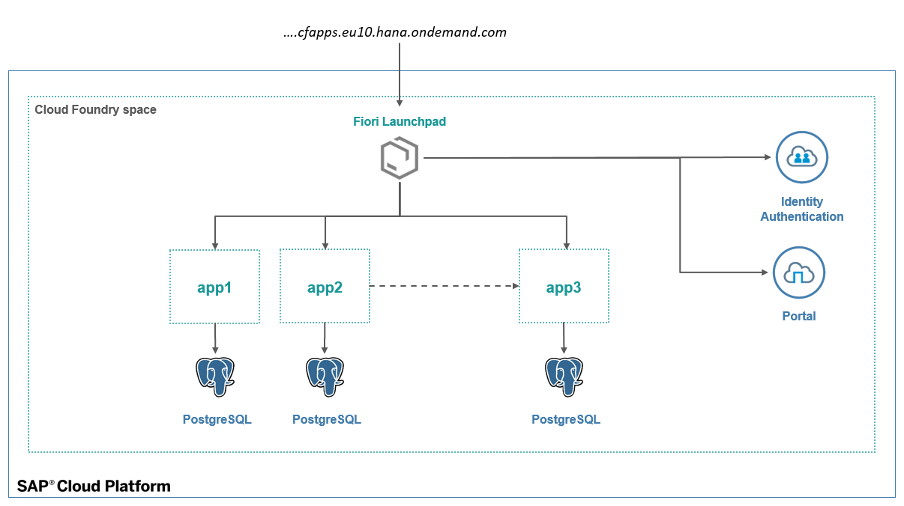
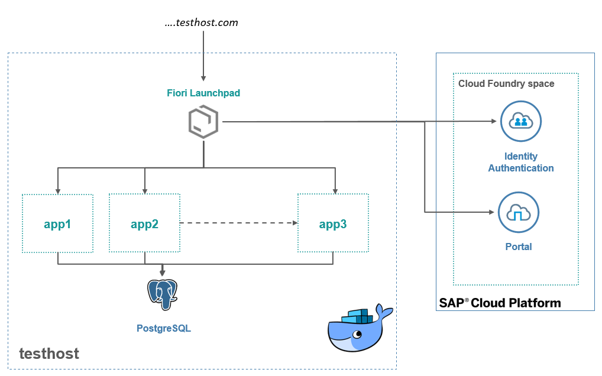

# Starter Project with Test Environment for SAP Cloud Foundry-based applications

 
## Overview

This starter project guides you through setting up a test environment for your Cloud Foundry-based application.

The test environment can be deployed on any infrastructure, all apps being run in a containerized environment using Docker (see also [Prerequisites](#Prerequisites)) 

Key features
* Maximize Dev/Prod parity: Test apps as if they were running on Cloud Foundry
* Have security enabled, by reusing the xsuaa service running in your CF account
* Test end-2-end scenarios, including Fiori Launchpad integration, by integrating with the SAP CP Portal service 
* all apps are run in 100% reproducible environments (using Docker)
* fully scripted setup, no copy&paste of environments, no manual tweaks & configuration

## Usage
Some more background information can be found in this blog post: [https://blogs.sap.com/2019/03/20/how-to-test-cloudfoundry-apps..outside-of-cloudfoundry/](https://blogs.sap.com/2019/03/20/how-to-test-cloudfoundry-apps..outside-of-cloudfoundry/)
### Demo Application
The starter project is based on a demo application following the architecture highlighted in the figure below:
 
Application sources for the dummy application can be found under [src](./src):
* `app` - a dummy Spring Boot app providing a `/test` endpoint
* `launchpad` - SAP Fiori Launchpad, integrated with the Spring Boot app
* `portal` - configuration for your SAP Portal Service (Fiori Launchpad site configuration)
* `xsuaa` - security configuration for your xsuaa service

### Test Environment
When testing the application, services from Cloud Foundry are reused by providing credentials in the Docker app environment. The resulting landscape looks as follows:
 

All artifacts for the test environment are found under [test-env](./test-env).
To test you application, login to your Cloud Foundry account (`cf login`) and run the scripts in order:
```
> ./1_init_cloud.cmd                # sets up services in your account
> ./2_deploy_portal_site.cmd        # deploys Fiori Launchpad configuration to the Portal service
> ./3_generate_docker_config.cmd    # prepare docker-compose configuration using CF service credentials
> ./4_start_apps.cmd                # starts all apps & services
```

## Prerequisites && Issues

Some prerequisites for getting the test environment to run
* CloudFoundry CLI & an account on the SAP Cloud Platform, Cloud Foundry edition
* Docker & Docker-Compose
* Node.JS
* maven/Java

Setup has been tested on Docker for Windows. If it does not work as expected, open an issue in this repository.